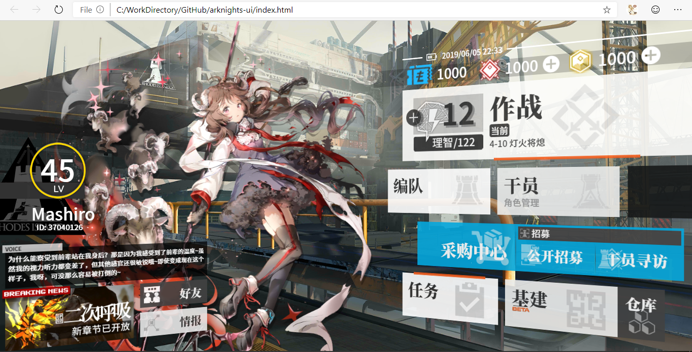

# Arknights UI：H5 + CSS 复刻明日方舟主界面

## Demo
<https://mashirozx.github.io/arknights-ui/>

## IDEA
本来只是想做个人物立绘挂上一个日历做壁纸的，然后顺手把按键也做了上去，感觉这么多键位可以开发不少功能呢。

## 立绘
立绘下载：<https://share.2heng.xin/?share/folder&user=1&sid=vRtSdN3p> 提取密码: U9HIc

## TODO
切换立绘、角色台词、支持修改用户信息、游戏等级的扇形图可以用来显示温度等信息、and more...

如果你实现了新的功能，欢迎 PR！

## 版权相关
界面贴图素材都是游戏逆向出来的，仅供学习使用，请勿商用。

## License
© [Mashiro](https://github.com/mashirozx/), Released under the [MIT](https://github.com/mashirozx/arknights-ui/blob/master/LICENSE) License.
